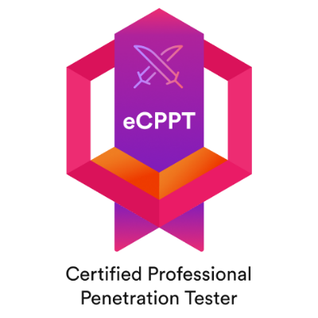

+++
title = 'My eCPPT Journey'
tags = ['eCPPT', 'Security']
keywords = ['eCPPT', 'Security', 'Certification']
date  = 2024-12-02
draft = false
description = "This post is a review of my experience of the eCPPT Exam"
+++

Last year I decided to move my study into security to give myself more exposure to this important area. I wasn't expecting the rabbit hole that it's sent me down. Studying for the eCPPT(Certified Professional Penetration Tester) has opened up a hole new community and it's been a brilliant year of learning, but more than I was expecting. I took the v2 exam, which is due to be retired at the end of December. Unlike the new v3 exam which is a 24hr exam, but no report to be created. The v2 was a 1-week lab exam with 1-week report write up phase.

## Resources ##
* [INE - Penetration Testing Professional](https://my.ine.com/CyberSecurity/learning-paths/9a29e89e-1327-4fe8-a201-031780263fa9/penetration-testing-professional-retiring-soon)

The content contained in this course was a little dated on the tooling, but the fundamentals were explained extremely well. The only problem I had was how the material was delivered. It was presented in a PowerPoint format, and sometimes there was a lag when moving through the slides. It would have been better to have just provided it as a pdf. It took me a while to get used to, and I'm still not a fan.

* [INE - Penetration Testing Professional (New)](https://my.ine.com/CyberSecurity/learning-paths/5e26d0ba-d258-49e0-a421-56cc06626f46/penetration-testing-professional-new-2024)

INE have created a new course for the v3 exam. Though this is tailored for the v3 exam, I found it a really good course that helped as an addition to v2 course.

* [Try Hack Me - Offensive Pentesting Learning Path](https://tryhackme.com/r/path/outline/pentesting)

For the Buffer Overflow development learning, this path contains "Buffer Overflow Prep", and "Gatekeeper". These were the best resources I found for Buffer Overflow development.

* [Try Hack Me - Wreath](https://tryhackme.com/r/room/wreath)

Pivoting is a large part of the exam, so it's something that you need to be confident with when entering the exam. Though you can complete the exam with Metasploit autoroute, proxychains and port forwarding. Learning the alternative methods to pivot helped to develop my skills, and it's always handy to have an alternative method to perform a task.

* [HTB Acacdemy - Penetration Tester Path](https://academy.hackthebox.com/path/preview/penetration-tester)

This was a fantastic course. The material is so detailed and the labs really flesh out the skills that they are trying to teach. I mixed this with HTB Labs to see how the techniques fit into an engagement. HTB have their own exams, and the HTB Certified Penetration Testing Specialist is something I'm looking at in the coming year.

### Labbing ###
* [INE - Skill Dive](https://ine.com/dive)

This is an extra service that is provided by INE. Though the courses have labs within the course. The Skill Dive has collections of labs that give you hands on learning. 

* [HTB Labs](https://www.hackthebox.com/hacker/hacking-labs)

Where INE Skill Dive focuses on a specific skill in the lab. The Labs provided by HTB Labs, are full engagements. If you go with the "pro subscription" this allows you to work on the retired boxes, which also come with walk throughs. I loved this, this was a brilliant way to develop my skills. HTB Academy has a tool also that links the courses with the boxes in HTB Labs, this is very useful.

### Advice ###

* Habit

This is the general advice for all exams. Touch the material daily.

* Pivoting

You need to have the skill of pivoting extremely developed. I'd recommend walking through the "Wreath" network on Try Hack Me a few times. If you do have the skill dive from INE, they have an awesome collection on using Metasploit and proxychains.

* Learn about bind and reverse shells

This is something that you need to understand. Within the exam you'll move through networks, so knowing how shells work is of importance so you use the correct payloads.

* Buffer Overflow

Try Hack Me has a great course for learning buffer overflows. You'll have to be prepared to spend a lot of time learning this skill. You'll have a buffer overflow on the exam, and you'll need to be able to develop the payload to complete the exam. I'd advise going through the prep course, then go through the "Gatekeeper" room several times.

* Reporting

My report was just over 80 pages. I used the [TCM - Pentest Report Template](https://github.com/hmaverickadams/TCM-Security-Sample-Pentest-Report), as a guide for creating my report. I also used [Pentest reports](https://pentestreports.com/), they have a lot of reports that you can read through and get a feel for how a professional report should be delivered.

### Conclusion ###

I enjoyed going down this rabbit hole, and it pushed me to develop two of my weaker areas(Windows administration, and web technologies). I'd say the course has opened my eyes to how the adversary looks at a network and how they'd attack it. Going forward, this skill will make me aware of the security implications of how I deploy infrastructure and implement processors. 

I wasn't really aware of how broad of a curriculum the exam would be. It touches on a lot of technologies. I'd recommend that you have a strong foundation in Linux administration, Windows administration and networking before attempting the eCPPT. 

