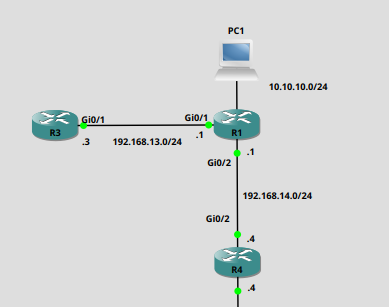

+++
title = 'EEM and a Downed Primary Circuit'
tags = ['Cisco','Automation']
keywords = ['Cisco', 'EEM', 'Automation']
date  = 2024-01-11
draft = false
+++

The Embedded Event Manager is a brilliant tool that can be found in the Cisco IOS. Before the development of IOS-EX, devices were limited to TCL and EEM to implement scripting locally on the device. Though we now get python available to us, TCL and EEM are very useful.

I'm just going to roll through a simple example of using EEM. We have a Primary and a Backup Circuit in our environment, but prefer to keep the interface of the Backup circuit shutdown when the Primary is active. So if we lose our Primary Connection, the interface connected to the Backup circuit needs to be brought up. This can be scripted with EEM, we'll also put recovery in there. So when the Primary circuit comes back we shut down our interface to the Backup circuit.

## Topology ##



## Implementation ##

So we'll be using EEM and also 'IP SLA' to perform this.

- First we need to create our ip sla instance. This will instruct the device to check the connectivity of the Primary Circuit.
```
ip sla 1
 icmp-echo 192.168.14.4 source-interface GigabitEthernet0/2
 frequency 5
ip sla schedule 1 life forever start-time now
```

- To allow the EEM scripts to monitor the SLA instance we need to create a track object.
```
track 1 ip sla 1 reachability
```

- Now we create the 'BACKUP' EEM script that will watch the track object for a change to the "down" state, and will bring up our Backup interface and print a syslog message, indicating that the Primary Circuit has gone down.
```
event manager applet BACKUP
 event track 1 state down
 action 100 cli command "enable"
 action 200 cli command "conf t"
 action 300 cli command "int gi0/1"
 action 400 cli command "no shut"
 action 500 syslog priority critical msg "THE PRIMARY CIRCUIT IS DOWN. BRINGING UP BACKUP INTERFACE"
```

- We also create a recovery script 'RECOVER', this will also be monitoring the track object we created. If the objects states changes from up to down, it will loop continually while returning 'false', using a ping as it's testing mechanism. If the the ping detects the lPrimary Circuit has recovered. The script will shutdown the backup interface and write a message to the syslog indicating recovery. 
```
event manager applet RECOVER
 event track 1 state up
 action 100 cli command "enable"
 action 110 set DONE "0"
 action 120 while $DONE ne 1
 action 130  wait 5
 action 140  cli command "ping 192.168.14.4 so gi0/2"
 action 150  regexp "!!!" "$_cli_result"
 action 160  if $_regexp_result eq "1"
 action 170   cli command "enable"
 action 181   cli command "conf t"
 action 192   cli command "int gi0/1"
 action 200   cli command "shut"
 action 210   cli command "end"
 action 220   set DONE "1"
 action 230  end
 action 240 end
 action 250 syslog priority notifications msg "Primary Interface Restored"
```

- Both of these scripts will continue to run in the background and are implemented when the variables change. For a Linux guy it's kind of like a Cron job, constantly running in the background watching for the state change of set variables.

- For the Backup link to be become the new default route, we'd have to set a static route with higher administrative number than the primary link. So when the Primary circuit drops and it's removed from the routing table, the the Backup route would be inserted.
```
ip route 0.0.0.0 0.0.0.0 GigabitEthernet0/2 192.168.14.4
ip route 0.0.0.0 0.0.0.0 GigabitEthernet0/1 192.168.13.3 20
```

- This shows the power of EEM. With just a few lines of code we are able to add reliability to our network even when certain constraints applied. A good reference for both EEM and TCL is the [TcL Scripting for Cisco IOS - Cisco Press](https://www.ciscopress.com/store/tcl-scripting-for-cisco-ios-9780133433739). 
