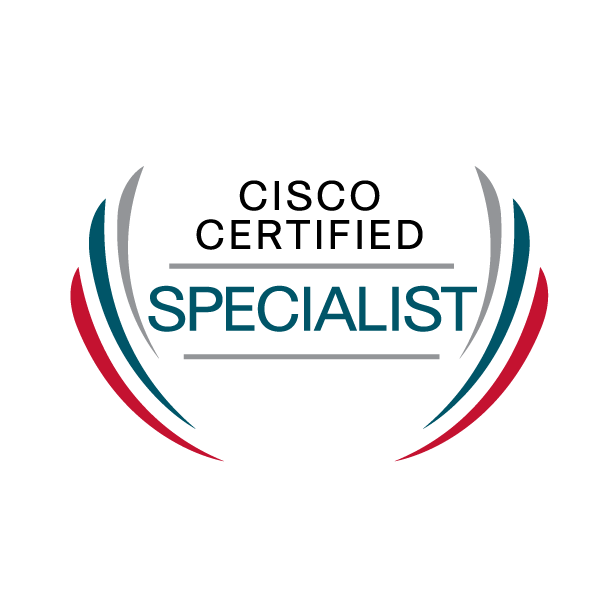

+++
title = 'My Cisco ENCOR Journey'
tags = ['ENCOR', 'Cisco', 'Certification']
keywords = ['Cisco', 'ENCOR', 'Certification']
date  = 2023-11-03
draft = false
description = "This post is a review of my experience of the Cisco Enterpirse Network Core Technologies(ENCOR) Exam"
+++

I passed my Cisco ENCOR exam just over a month ago. I took it on the last day of V1.0.
Thought I'd give an overview of the resources I used and how I found things.
Obviously the Exam has now changed, so other resources maybe required.

## Resources ##
### Core Books ###

I would read every morning as soon as I woke. This way I guaranteed that I covered something everyday regardless of what got in the way.

* [CCNP and CCIE Enterprise Core ENCOR 350-401 Official Cert Guide Premium Edition eBook and Practice Test](https://www.ciscopress.com/store/ccnp-and-ccie-enterprise-core-encor-350-401-official-9780135262030)

Though I feel that most of the exam was covered by the OCG. I would recommend further reading around topics to develop confidence in the technologies.

* [31 Days Before Your CCNP and CCIE Enterprise Core Exam](https://www.ciscopress.com/store/31-days-before-your-ccnp-and-ccie-enterprise-core-exam-9780136965220)

This was my favourite book. It's very dog-eared now, and I actually enjoyed reading this. Though it's meant to be for the last month of study, I actually used it throughout.

* [CCNP and CCIE Enterprise Core & CCNP Enterprise Advanced Routing Portable Command Guide](https://www.ciscopress.com/store/ccnp-and-ccie-enterprise-core-ccnp-enterprise-advanced-9780135768167)

This is a handy book to keep on the desk when labbing. When you want to clarify a specific config. The sections can also be worked through as well. I liked working through the tunneling section.

* [CCNP and CCIE Enterprise Core ENCOR 350-401 Exam Cram](https://www.informit.com/store/ccnp-and-ccie-enterprise-core-encor-350-401-exam-cram-9780136891932)

Not a bad book, but preferred the 31 Days Before. It provides a good overview, but found that it wasn't detailed enough.

* [CCNP Enterprise: Core Networking (ENCOR) v8 Lab Manual](https://www.ciscopress.com/store/ccnp-enterprise-core-networking-encor-v8-lab-manual-9780136906438)

This provides a good set of Labs. Setting them up is time-consuming, so I found when building them in GNS3, I'd use the snapshots funciton. This meant I only had to build them once.

#### Additional Reading ####

The following books I used parts of to help me understand concepts more thoroughly.

* [CCNP Enterprise Advanced Routing ENARSI 300-410 Official Cert Guide Premium Edition eBook and Practice Test](https://www.ciscopress.com/title/9780135262054)

* [IKEv2 IPsec Virtual Private Networks: Understanding and Deploying IKEv2, IPsec VPNs, and FlexVPN in Cisco IOS](https://www.ciscopress.com/store/ikev2-ipsec-virtual-private-networks-understanding-9781587144608)

* [Cisco Software-Defined Access](https://www.ciscopress.com/store/cisco-software-defined-access-9780136448389)

* [Cisco Express Forwarding](https://www.ciscopress.com/store/cisco-express-forwarding-9780133433340)

* [QoS for IP/MPLS Networks](https://www.ciscopress.com/store/qos-for-ip-mpls-networks-9780133434996)

* [TcL Scripting for Cisco IOS](https://www.ciscopress.com/store/tcl-scripting-for-cisco-ios-9780133433739)

### Video/Platform Based Training ###

* [CBT Nuggets - CCNP Enterprise \(350-401 ENCOR\)](https://www.cbtnuggets.com/it-training/cisco/ccnp-enterprise-core)

I really like CBT Nuggets and the trainers over there. I feel they're ENCOR course provides a good base. If using CBT Nuggets I'd recommend mixing in some of the specialist course, such as the deeper dives of BGP, OSPF, QOS.

* [INE - CCNP Enterprise Learning Path](https://ine.com/learning/paths/ccnp-enterprise)

Out of all the providers, INE is my favourite. I prefer the long form videos, where you can spin up the same lab in GNS3/Eve-ng and work along side the trainer. The videos are really in depth, and I'd say go beyond the point required for the Exam.

* [LiveLessons - CCNP and CCIE Enterprise Core ENCOR 350-401 Complete Video Course](https://www.ciscopress.com/store/ccnp-and-ccie-enterprise-core-encor-350-401-complete-9780136584124)

It provides a good coverage of the blueprint. More heavy on concepts than showing practical walk throughs.

* [KishSquared - ENCOR Study Group](https://www.youtube.com/watch?v=-y8sdl8H3cY&list=PLOpoM7HdItaLzI-ikzNRbeE-6JJJV2tSu)

This is a nice collection of videos that Jeff put together that covers parts of the syllabus.

* Other Notable Mentions

[Kevin Wallace Training](https://www.youtube.com/@kwallaceccie)

[Keith Barker - The OG of IT](https://www.youtube.com/@KeithBarker)

[NetworkLessons.com](https://networklessons.com/)

[CCIEORDIE.COM](https://www.youtube.com/@Ccieordie_arteq/videos)

### Practice Exam's ###

* [Boson.com - ExSim-Max for Cisco 350-401 ENCOR](https://www.boson.com/practice-exam/350-401-ENCOR-cisco-ccnp-practice-exam)

The gold standard for Exams. The answers for the questions are very detailed. I'd recommend using the links to the Cisco Documentation, this will help you become familiar with using Cisco Documentation. These were most like the exam.

* [The Cisco Learning Network - Cisco Exam Review ENCOR](https://learningnetworkstore.cisco.com/assessments-and-practice-exams/cisco-exam-review-encor/CER-ENCOR-V1-026006.html)

This is a good learning tool. I found it more heavy on labs than the real exam, but that's not a bad thing. I liked this, but the answers aren't as detailed as Boson.

* [Pearson Test Prep](https://www.ciscopress.com/store/ccnp-and-ccie-enterprise-core-encor-350-401-official-9780138216764)

These questions are not at the same level as the Exam, but are a good learning tool to mix in with your learning strategy.

### Automation ###

In all truthfulness, none of the Video series covered the Automation section very well.

Luckily, DevNet has a good course. 

* [Learn network programmability basics](https://developer.cisco.com/video/net-prog-basics/)

### Labbing ###
 
* [GNS3](https://gns3.com/)

My personal preference is to use GNS3. Though I have a hardware lab, I found that I did 90% of my ENCOR specific labs in GNS3. 

The only exception being WLC involved labs. I had to connect my WLC from my home lab to GNS3 for my wireless labs, only as I didn't have a WLC image at the time. I wouldn't buy a WLC just for the ENCOR. Keith Barker has some packet tracer labs  that I think will provide enough of a feel of a WLC for the Exam.

## Advice ##

* Habit

The importance of touching something daily.

I got into the habit of opening the blueprint and my study spreadsheet when I start a study session. Just to drill home what was, and wasn't on the blueprint.

Create a study spreadsheet. I broke down the blueprint into a spreadsheet, and found it invaluable to make sure that I'd covered each topic thoroughly.

* Notes

Have a good note-taking system. I find taking notes whilst following more concept based training keeps my mind from wandering. 

I also find the process of working through my notes and editing them later solidifies the concepts. 

But the biggest benefit I find to taking notes is creating your own engineers notebook. Having previous solutions that you've created, with notes stops the "recreation of the wheel" problem. This becomes a tool not just for the exam but for your career. 

I keep organized notes using org mode in Emacs. Emacs has modules that help you search and sort your notes.

* Documentation

Cisco white papers and documentation are your friend. Learning to navigate the documentation is a skill all of its own, and it pays a huge dividend once you nail it.

Obviously these are just things that I personally found helpful, everyone has a different study style.

## Mistakes ##

* Going too deep on topics

The exam has a huge curriculum. I struggle with just learning what you need to learn. When I start a topic I find interesting, I can't help but dive deep into that topic. You just can't with this exam. You really have to stick to the blueprint. This is a skill that I had to learn.

* Covering material that you know

I find that I can end up covering material that I already know, just because it's in a learning path of a course or in a chapter in a book. I have a bit of a tick box obsession. This doesn't help with time management, be confident if you do know a topic to say, I don't need to cover this again and spend that time in an area that does.

## My Take Away ##

If you had asked me my opinion of the ENCOR whilst I was studying for it, you would have got some discouraging comments peppered with some blue language. Now at the end of it, I do understand why it has the breadth that it does. I feel it has made me a more complete engineer. It was a worthwhile course, and I would recommend it.

