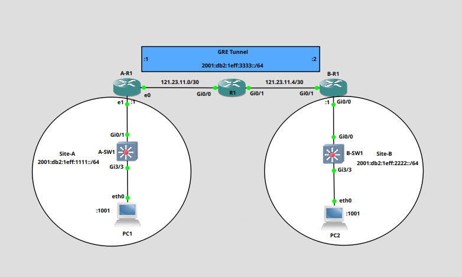
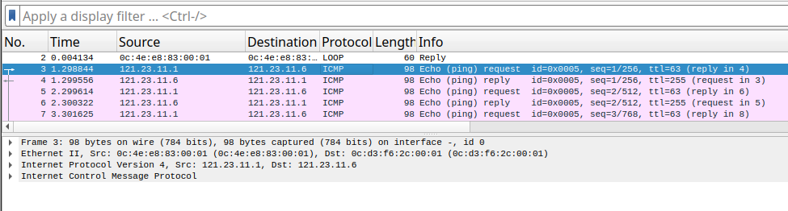
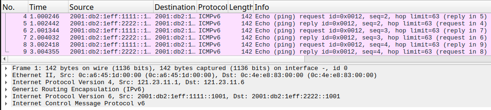

Generic Routing Encapsulation(GRE) tunnels are a technology that was developed by Cisco but, is now an open standard through [RFC 2784](https://www.rfc-editor.org/rfc/rfc2784).
GRE tunnels can provide use with a lot of versatility when needing to move different protocols between networks. Though we have now moved into an era that is predominantly TCP/IP, when GRE was developed it was at a time of multiple network technologies, IPX, Appletalk, Token Ring, etc, flourished. GRE provided the ability to encapsulate these technologies and let them traverse an Internet Protocol network.

Though we no longer live with those antiquated technologies, it doesn't mean that GRE has lost its usability. We have seen the last IPv4 addresses issued, and though we've heard the warning, "IPv6 is just around the corner" for over two decades, I do feel we might be finally seeing it arrive(and that's a good thing). During the migration to IPv6 we'll see situations where we have discontiguous networks. Where islands of IPv6 networks are connected by IPv4 networks. This is where GRE tunnels can help. GRE has the ability to encapsulate the IPv6 traffic and transport it over the IPv4 network.

One consideration that has to be taken into account when using GRE, is that alone, it doesn't have any secuirty. All traffic is sent in the clear. We can add IPsec to provide security to our traffic, but in this example we'll just be implementing a simple GRE tunnel.

The following example will show the interoperability of GRE between a Cisco router and an Oracle Linux box functioning as a router.

## Topology ##



In our topology, we have two ipv6 sites connected via an ipv4 network. Though our topology only has one router between our two sites, this is irrelevant, it could be any number. The only important factor is that A-R1 and B-R1 are able to route to each other. This can be achieved with routing protocols or with static routes. This is what is known as the underlay.

### Confirming the Underlay ###

First, we have ensure that we have the underlay in place. We'll be using static routes to achieve this.
- A-R1
```
[root@oracle-cloud ~]# ip route show 121.23.11.4/30
121.23.11.4/30 via 121.23.11.2 dev eth0 proto static metric 100 
```

- B-R1
```
B-R1#show ip route 121.23.11.1   
Routing entry for 121.23.11.0/30
  Known via "static", distance 1, metric 0
  Routing Descriptor Blocks:
  * 121.23.11.5, via GigabitEthernet0/1
      Route metric is 0, traffic share count is 1
```



Pinging B-R1 from A-R1 shows that we have connectivity between the two routers. We are now able to build our Overlay.

### Building the Overlay ###
We refer to the GRE tunnel that we build between A-R1 and B-R1 as the overlay. These packets will be encapsulated within the underlay packets and the network devices in-between the two routers don't touch the encapsulated packets.

#### Configuration of A-R1 ####
We are using an Oracle Linux machine as a Router at site A.

- First, we need to create our tunnel interface, and apply the ipv6 address.
Interface gre0 is reserved, so any number but this is allowed
```
nmcli con add type ip-tunnel ip-tunnel.mode gre con-name gre1 ifname gre1 remote 121.23.11.6 local 121.23.11.1
nmcli connection modify gre1 ipv6.addresses '2001:db2:1eff:3333::1/64'
```

- Now bring up the tunnel interface
```
nmcli con up gre1
```

- We'll use a static route, to route traffic to Site B
```
nmcli con modify gre1 +ipv6.routes "2001:db2:1eff:2222::/64 2001:db2:1eff:3333::2"
```

- Forwarding needs to be enabled on the device for it to function as a router
```
echo "net.ipv6.ip.conf.all.forwarding=1" >/etc/sysctl.d/96-IPv6-forwarding.conf
sysctl -p /etc/sysctl.d/96-IPv6-forwarding.conf
```


#### Configuration of B-R1 ####
We are using a Cisco Router at site B.

- As we'll be using ipv6 we need to implement ipv6 routing on the device
```
ipv6 unicast-routing
```


- We'll create the tunnel interface
```
interface Tunnel0
 ipv6 address 2001:DB2:1EFF:3333::2/64
 tunnel source 121.23.11.6
 tunnel destination 121.23.11.1
```

- You'll notice that we didn't have to set the tunnel to be GRE. This is because GRE/IP is the default tunneling protocol for Cisco devices. Below is how you'd manually set the tunnel to GRE/IP
```
tunnel mode gre ip
```

- We can confirm that the interface is configured with GRE over IP with the following command
```
B-R1#show int tunnel 0 | i protocol/transport
  Tunnel protocol/transport GRE/IP
```

- We now need a static route to connect Site-B to Site-A
```
ipv6 route 2001:DB2:1EFF:1111::/64 2001:DB2:1EFF:3333::1
```

### Confirm Site-A to Site-B Connectivity ###
We can use PC1 at Site-A to ping PC2 at Site-B.
```
root@PC1:~# ping6 2001:db2:1eff:2222::1001
PING 2001:db2:1eff:2222::1001(2001:db2:1eff:2222::1001) 56 data bytes
64 bytes from 2001:db2:1eff:2222::1001: icmp_seq=1 ttl=62 time=3.12 ms
64 bytes from 2001:db2:1eff:2222::1001: icmp_seq=2 ttl=62 time=3.57 ms
64 bytes from 2001:db2:1eff:2222::1001: icmp_seq=3 ttl=62 time=5.03 ms
64 bytes from 2001:db2:1eff:2222::1001: icmp_seq=4 ttl=62 time=4.32 ms
```

Using a Wireshark capture between A-R1 and B-R1 we can confirm that the traffic is being encapsulated in the GRE tunnel.


If you view the Wireshark capture, you will see that the GRE is being used.

Though there are a few moving parts in the configuration of GRE, it's not that difficult to implement, and by building the tunnel between a Linux box and a Cisco device, I just wanted to show the versatility of GRE.


