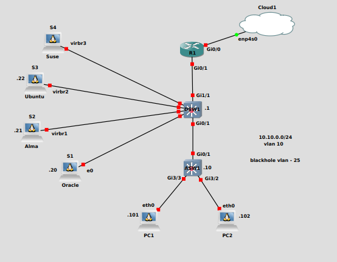
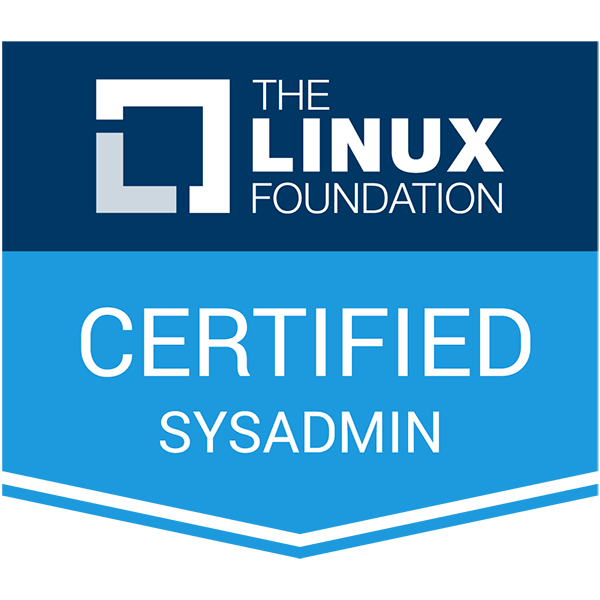

+++
title = 'My LFCS Journey' 
date  = 2023-12-13
draft = false
+++

I passed my Linux Foundation Certified Systems Administrator Exam a few weeks back. This was a recertification. Since I last took the exam the syllabus has been overhauled. Where previously you would choose between CentOS and Ubuntu, they have now gone for a vendor neutral approach. 

I was hoping for the release of the new LFCE, but I fear that this is never coming. I did message the team a year ago and was told it was in development, but haven't seen any update. This will be a future decider for whether to stay with the Linux Foundation or move over to the Red Hat certification track. As there isn't any advancement, only lateral movement through the Kubernetes certifications.

## Resources ##
### Books ###

* [Red Hat RHCSA 8 Cert Guide: EX200, 2nd Edition](https://www.informit.com/store/red-hat-rhcsa-8-cert-guide-ex200-9780137341627)

Sander van Vugt does a good job as always with his cert book. I jumped a few of the sections that I'm very familiar with, but this is a good book.

* [Mastering Ubuntu Server 4th edition](https://ubuntuserverbook.com/)

Previously I would use the Ubuntu unleashed, but after watching content for Jay LaCroix on his YouTube channel I thought I would give his book a go. It's a brilliant resource and found it a good read.

### Video/Platform Based Learning ###

* [KodeKloud - Linux Foundation Certified System Administrator](https://kodekloud.com/)

I found this course contained everything I needed to pass the exam. The labs are good and all areas of the syllabus are covered.

#### Other Notable Mentions ####

[Learn Linux TV](https://www.learnlinux.tv/)

This is Jay LaCroix site. This is just a great resource in general for Linux. He has great forum and his content is interesting.

### Practice Exam's ###

* [KodeKloud - Linux Foundation Certified System Administrator](https://kodekloud.com/)

The course from KodeKloud comes with 4 practice exams. They are excellent, and I felt that though each exam didn't cover all the syllabus in each. All four covered everything.

* [Killer Shell - LFCS Simulator Session](https://killer.sh)

With your exam, you get two runs on the simulator. This is brilliant and sets you up for the exam, not just the questions but the feel of the exam as well. Both exams are the same questions, this is my only complaint.

### Labbing ###

* [KodeKloud](https://kodekloud.com/)

KodeKloud provide very good labs, I went through each one at least once. If this is your first time taking the LFCS, I'd say run through the labs a couple of times.

* [GNS3](https://gns3.com/)

Though KodeKloud provide great labs, I enjoy following along and testing what I'm reading or watching. I see a lot of people just use a VM. I actually put together a small setup in GNS3. I had an Ubuntu Server, a Alma server, and an Oracle Linux server all hanging off a distribution switch. This meant I could jump between distros for testing and seeing the differences. I also tested static routing by attaching machines to the Router in the lab. It might be over kill for some people but once it was set up it gave me a good test environment.

## Advice ##

* Habit

As will all exams, the need to touch the material daily is a must.

I used the [Domains & Competencies](https://training.linuxfoundation.org/certification/linux-foundation-certified-sysadmin-lfcs/) and the Course Outline from [Linux System Administration Essentials (LFS207)](https://training.linuxfoundation.org/training/linux-system-administration-essentials-lfs207/) to build a study spreadsheet. The LFS207 is the recommended course from the Linux Foundation. The $300 price I felt wasn't worth it personally as I was recertifying.

* Note-Taking

I love my notes. This exam actually made me do some housekeeping to my old Linux notes that I hadn't touched in a while. I know some people don't value notes, but I use mine daily for reference. Whether it's looking up a section of code, or how a specific config is implement, or that bash one-liner I often use, but not often enough to remember. The value of notes for the exam might not be crucial, but I think the time they save down the road is worth it. 

* Networking

They have upped the game when it comes to the networking knowledge required. I actually love this as I'm heavy into networking, but if you don't touch networks much, it might be worthwhile just picking up a basic networking course off YouTube. That they have put routing, configuring bridges and bonding devices into the Competencies I think is a big thumbs up.

## My Take Away ##

The task based exam is by far better than multiple choice exams. It really tests your knowledge. I actually enjoyed the exam. I thought it was a good test of my skills. I do think as the two exams have now been merged the Linux Foundation should provide beter signposting for what tools they will be testing you on. But that's it done for another 3yrs.

