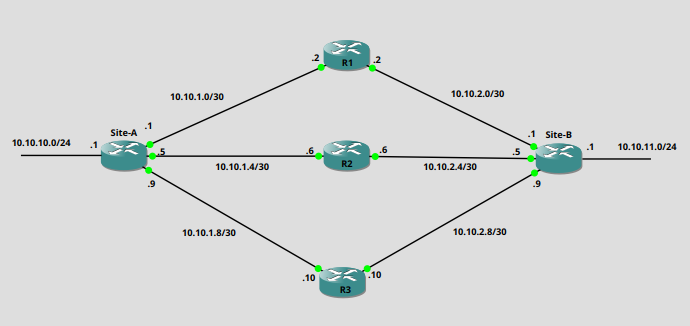

+++
title = 'Link Redundancy with Administrative Distance'
tags = ['Cisco','Routing']
keywords = ['Cisco', 'Routing', 'Administrative Distance', 'AD']
date  = 2024-01-17
draft = false
+++

In the previous post I worked through how to use EEM when we had the constraint of having to keep the Backup circuit interface shutdown when not in use. Without this constraint we can implement redundancy with just Administrative Distance.

### Administratvie Distance ###
This is a metric that is used by vendors to rate the reliability of a route. Vendors do use different metrics. I'll be using Cisco devices in this example. The lower the AD(Administrative Value) value the more reliable a route is deemed.

|Protocol        |Administrative Distance|
|:---------------|----------------------:|
|Connected       | 0|
|Static          | 1 |
|eBGP            | 20|
|OSPF            | 110|
|RIP             | 120|

Above we can see some values for routing protcols, static and connected routes.

Administrative distance comes into play when we have two identical routes, but they are provided by different methods. 

If OSPF has a route for 10.10.1.0/24 and we have a static route for 10.10.1.0/24, the static route will be placed into the routing table as it has the lower AD. Though the OSPF route isn't entered into the routing table it still kept in the OSPF Database. If the static route was to be removed it would then be inserted into the Routing table.

This functionality can be used by use to implement redundancy. If we have a Primary circuit and a Backup circuit we can set the Backup with a higher AD and if the Primary ever fails, the Backup will be inserted into the routing table.

In the following example I'll show how the routing table is influenced by different AD values. We'll have one default static route(Site-A - R1), one static route with a modified AD of 10(Site-A - R2), and one OSPF advertisement(Site-A - R3 - Site-B). We'll drop connections and see how routes are added to the routing table.

### Topology ###



- Site-A static routes
```
ip route 10.10.11.0 255.255.255.0 GigabitEthernet0/1 10.10.1.2
ip route 10.10.11.0 255.255.255.0 GigabitEthernet0/2 10.10.1.6 10
```
- From the OSPF database at Site-A we can see that Site-B is advertising a Type 1 LSA for the 10.10.11.0/24 network
```
Site-A#sh ip ospf database router 10.10.11.1 

            OSPF Router with ID (10.10.10.1) (Process ID 10)

                Router Link States (Area 0)

  LS age: 315
  Options: (No TOS-capability, DC)
  LS Type: Router Links
  Link State ID: 10.10.11.1
  Advertising Router: 10.10.11.1
  LS Seq Number: 8000000B
  Checksum: 0x5A1F
  Length: 48
  Number of Links: 2

    Link connected to: a Stub Network
     (Link ID) Network/subnet number: 10.10.11.0
     (Link Data) Network Mask: 255.255.255.0
      Number of MTID metrics: 0
       TOS 0 Metrics: 1

    Link connected to: a Transit Network
     (Link ID) Designated Router address: 10.10.2.10
     (Link Data) Router Interface address: 10.10.2.9
      Number of MTID metrics: 0
       TOS 0 Metrics: 1
```

### Dropping of Connections ###

With no routes removed this is the routing table entry for 10.10.11.0/24
```
Site-A#sh ip route 10.10.11.0 255.255.255.0
Routing entry for 10.10.11.0/24
  Known via "static", distance 1, metric 0
  Routing Descriptor Blocks:
  * 10.10.1.2, via GigabitEthernet0/1
      Route metric is 0, traffic share count is 1
```
- We can see that the route is a static route and has the default AD of 1.


We'll now drop the connection to R1
```
Site-A#sh ip route 10.10.11.0 255.255.255.0  
Routing entry for 10.10.11.0/24
  Known via "static", distance 10, metric 0
  Routing Descriptor Blocks:
  * 10.10.1.6, via GigabitEthernet0/2
      Route metric is 0, traffic share count is 1
```
- We now see that the traffic will be moving through R2. Though static routes have a default of 1, we have the ability to manually set the AD of the route. If you look back at the routes you'll notice that it was set to 10. If both routes would have been set to 1 we would have seen a function called Equal Cost Multi-Path(ECMP) take place, where both routes would be used equally.

We'll now drop the connection to R2

```
Routing entry for 10.10.11.0/24
  Known via "ospf 10", distance 110, metric 3, type intra area
  Last update from 10.10.1.10 on GigabitEthernet0/3, 00:00:08 ago
  Routing Descriptor Blocks:
  * 10.10.1.10, from 10.10.11.1, 00:00:08 ago, via GigabitEthernet0/3
      Route metric is 3, traffic share count is 1
```
- And finally we see the OSPF route being used as it has the AD of 110.

Though all these routes weren't present in the Routing Table, they weren't discarded, but held by the router until they became the more favourable route.


