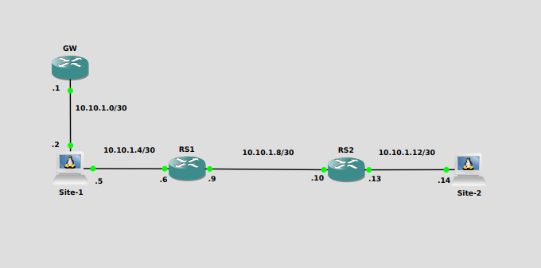
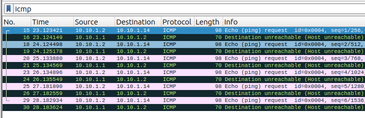

+++
title = 'Linux Static Route'
tags = ['Linux']
keywords = ['Linux', 'Networking']
date  = 2024-01-01
draft = false
description = "This post walks through the setting up of static routes on Linux"
+++

Whilst recently recertifying for my LFCS the networking section had been further expanded and now included static routes. I thought this was fantastic. Though I know a lot of people use linux, I doubt many get down into the plumbing, and work with the networking on their machines. This is just going to be a little walk through of setting up a static route. 

Static routes can come in handy for connecting environments with multiple networks. By using static routes, we can direct our traffic, and make sure the more efficient paths are being used.

### The Lab Environment ###




Currently any traffic to the 10.10.1.4/30 network will go out of enp7s0, but all other traffic will use the default gateway at 10.10.1.1
```
[user@localhost ~]$ ip route show
default via 10.10.1.1 dev enp1s0 proto static metric 100 
10.10.1.0/30 dev enp1s0 proto kernel scope link src 10.10.1.2 metric 100      
10.10.1.4/30 dev enp7s0 proto kernel scope link src 10.10.1.5 metric 101      
```

When we attempt to ping Site-2, our pings will be sent to the default gateway as the routing table doesn't have an entry for the network.
The Wireshark output below, shows the ping being sent to GW, but GW also doesn't have a route for Site-2. 



So to easily remedy this, we can implement a static route on Site-1.

### Methods ###

We have two ways of implementing the static route:
  - Temporarily - Using 'ip'
  - Permanently - Using 'NetworkManager'
  
### Implementing with ip ###
  
First we will show you how to do this with the ip tool.
```
[user@localhost ~]$ sudo ip route add 10.10.1.12/30 via 10.10.1.6 dev enp7s0
```

Viewing the routing table for Site-1 we now see that a route has been added for the 10.10.1.12 network.
```
[user@localhost ~]$ ip route show
default via 10.10.1.1 dev enp1s0 proto static metric 100 
10.10.1.0/30 dev enp1s0 proto kernel scope link src 10.10.1.2 metric 100 
10.10.1.4/30 dev enp7s0 proto kernel scope link src 10.10.1.5 metric 101 
10.10.1.12/30 via 10.10.1.6 dev enp7s0 
```

Now when we ping Site-2 we see a response.
```
[user@localhost ~]$ ping 10.10.1.14
PING 10.10.1.14 (10.10.1.14) 56(84) bytes of data.
64 bytes from 10.10.1.14: icmp_seq=1 ttl=62 time=2.22 ms
64 bytes from 10.10.1.14: icmp_seq=2 ttl=62 time=1.54 ms
64 bytes from 10.10.1.14: icmp_seq=3 ttl=62 time=1.52 ms
64 bytes from 10.10.1.14: icmp_seq=4 ttl=62 time=1.54 ms
^C
--- 10.10.1.14 ping statistics ---
4 packets transmitted, 4 received, 0% packet loss, time 3005ms
rtt min/avg/max/mdev = 1.518/1.705/2.219/0.296 ms
```

As mentioned this is a temporary route, when the machine is rebooted the route will disappear. The advantage of this method is that you don't have to interfere with the connection to implement the route. It can be a fix between maintenance windows if you are worried about dropping the connection, or if testing before making permanent.

### Implementing with NetworkManger ###

To make the route permanent, we need to edit the Network Managment Service, which for Red Hat like systems is NetworkManger.

We have several options to do this:
  - nmcli  
    - The command line option
  - nmedit 
    - This is a interactive session the command line
  - nmtui  
    - This is an ncurses based appliction
  - Gui    
    - There are gui packages available
  
We'll use the nmcli option to set the route.
```
[user@localhost ~]$ sudo nmcli connection modify enp7s0 +ipv4.routes "10.10.1.12/30 10.10.1.6"
```

If we look at the routes, we will see that the route hasn't been added yet
```
[user@localhost ~]$ ip route show
default via 10.10.1.1 dev enp1s0 proto static metric 100 
10.10.1.0/30 dev enp1s0 proto kernel scope link src 10.10.1.2 metric 100 
10.10.1.4/30 dev enp7s0 proto kernel scope link src 10.10.1.5 metric 101 
```

We need to reactivate the connection for the route to take effect
```
user@localhost ~]$ nmcli connection up enp7s0
Connection successfully activated (D-Bus active path: /org/freedesktop/NetworkManager/ActiveConnection/22)
[user@localhost ~]$ ip route show
default via 10.10.1.1 dev enp1s0 proto static metric 100 
10.10.1.0/30 dev enp1s0 proto kernel scope link src 10.10.1.2 metric 100 
10.10.1.4/30 dev enp7s0 proto kernel scope link src 10.10.1.5 metric 101 
10.10.1.12/30 via 10.10.1.6 dev enp7s0 proto static metric 101 
```

We'll ping Site-2 for verification
```
[user@localhost ~]$ ping 10.10.1.14
PING 10.10.1.14 (10.10.1.14) 56(84) bytes of data.
64 bytes from 10.10.1.14: icmp_seq=1 ttl=62 time=2.74 ms
64 bytes from 10.10.1.14: icmp_seq=2 ttl=62 time=1.58 ms
64 bytes from 10.10.1.14: icmp_seq=3 ttl=62 time=1.74 ms
64 bytes from 10.10.1.14: icmp_seq=4 ttl=62 time=1.71 ms
^C
--- 10.10.1.14 ping statistics ---
4 packets transmitted, 4 received, 0% packet loss, time 3005ms
rtt min/avg/max/mdev = 1.576/1.939/2.738/0.465 ms
```

As you can see implementing static routes in Linux is reletively painless. This was a simple example. You can get extremely detailed with the route attributes, such as setting TOS values, mtu size, window size and much more. 

A good resource for Static Routing is [Configuring static routes](https://access.redhat.com/documentation/en-us/red_hat_enterprise_linux/9/html-single/configuring_and_managing_networking/index#configuring-static-routes_configuring-and-managing-networking) from the Red Hat documentation.
