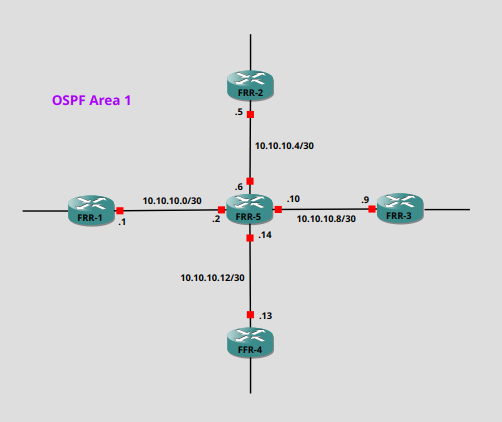

Though Linux is usually thought of as a server OS. It has huge amount of other implementations from embedded systems, the world of IOT, the mobile phone sector, and we're all still waiting for the year of the Linux Desktop(sure it'll be this year). But a function that is often over looked is the available routing protocol suite that eanbles linux to function as a router.

The routing protocol suite started off as a project called Zebra, which after becoming discontinued morphed into [Quagga Routing Software](https://github.com/Quagga). We'll be using [FRRouting](https://frrouting.org/), which is a project that has been forked from Qugga, and is under active development.

FRR provides use with the ability to work with many dynamic routing protocols:
  - OSPFv2/OSPFv3
  - BGP
  - RIP/RIPng
  - ISIS
  
Is this example, we're going to create a single OSPFv2 area with FRR installed on Alpine Linux.


## Topology ##



### Configuration of FRR-1 ###

I'll walk through the configuration of FRR-1. The configuration will be the same on the other devices, with just the addressing needing to changed for the device.

We have two methods for configuring the device. 
- Configuration file /etc/frr/frr.conf - This file can be thought of as the Cisco config file, but unlike the Cisco config file we can interact with this in a text editor to create the configuration.
- Vtysh - This is the interactive shell. Has the feel of the Cisco command line. The commands that you set through the vtysh are written to /etc/frr/frr.conf.


#### Setting the Hostname ####
Though we have a hostname command under the FRR interactive shell, this sets the hostname only for this session, it doesn't update the /etc/hostname after a reboot. So we need to set the hostname in the /etc/hostname file.

```
FRR-1# echo "FRR-1" > /etc/hostname
FRR-1:~# cat /etc/hostname 
FRR-1
```

#### IP Addressing ####
With the hostname set, we can now move back into the interactive shell and set the ip address details.
```
FRR-1:~# vtysh

Hello, this is FRRouting (version 8.1).
Copyright 1996-2005 Kunihiro Ishiguro, et al.

FRR-1# conf t
FRR-1(config)# interface eth1
FRR-1(config-if)# ip address 10.10.10.1/30
FRR-1(config-if)# 
```


#### OSPF Configuration ####
If we only require a single instance of OSPF we can continue with the configuration, just omit the instance id. I'm going to continue by setting up 3 instances, just to show the process, even though we only require one for this example. 

To enable instances, we need to edit the /etc/frr/deamons.
```
ospfd=yes
ospfd_instances=1,5,6
```
- I found that just restarting the frr process, didn't enable the instances in the vtysh though they showed running on the system, and I had to reboot the device.

We'll now set the router-id for the device.
```
FRR-1:~# vtysh 

Hello, this is FRRouting (version 8.1).
Copyright 1996-2005 Kunihiro Ishiguro, et al.

FRR-1# conf t
FRR-1(config)# router ospf 1
FRR-1(config-router)# ospf router-id 1.1.1.1
```
- If we don't set the router-id, then the default that we see in Cisco is used; where the highest loopback address is used first, and if no loopback, then the highest interface address.

A caveat to using instances with FRR is that the network command under the process isn't available, and we have to configure OSPF under the interface.
```
FRR-1(config-router)# network 10.10.10.0/30 area 1
The network command is not supported in multi-instance ospf
FRR-1(config-router)# int eth1
FRR-1(config-if)# ip ospf 1 area 1
```

We can now verify that ospf has been setup to advertise the 10.10.10.0/30 network.
```
FRR-1# sh ip ospf 1 interface

OSPF Instance: 1

eth1 is up
  ifindex 3, MTU 1500 bytes, BW 1000 Mbit <UP,BROADCAST,RUNNING,MULTICAST>
  Internet Address 10.10.10.1/30, Broadcast 10.10.10.3, Area 0.0.0.1
  MTU mismatch detection: enabled
  Router ID 1.1.1.1, Network Type BROADCAST, Cost: 100
  Transmit Delay is 1 sec, State DROther, Priority 1
  Designated Router (ID) 10.10.10.2 Interface Address 10.10.10.2/30
  Backup Designated Router (ID) 10.10.10.2, Interface Address 10.10.10.2
  Multicast group memberships: OSPFAllRouters
  Timer intervals configured, Hello 10s, Dead 40s, Wait 40s, Retransmit 5
    Hello due in 7.467s
  Neighbor Count is 1, Adjacent neighbor count is 1

```
- As we haven't set the network type it defaults to Broadcast, as the media type is Ethernet. 

We'll set the interface to point-to-point as we are on a /30 network.
```
FRR-1# conf t
FRR-1(config)# int eth1
FRR-1(config-if)# ip ospf network point-to-point 
FRR-1(config-if)# end
FRR-1# sh ip ospf 1 int | include Type
  Router ID 1.1.1.1, Network Type POINTOPOINT, Cost: 100

```

We now can complete the IP addressing and OSPF configuration on the other routers, using the above instructions, just adjusting for the IP address and the network information.

#### Verification of the OSPF Configuration ####

With all the routers now configured with IP addressing and OSPF activated for the required networks, we can confirm that we are seeing all routers in the OSPF database.
```
FRR-1# sh ip ospf 1 database 

OSPF Instance: 1


       OSPF Router with ID (1.1.1.1)

                Router Link States (Area 0.0.0.1)

Link ID         ADV Router      Age  Seq#       CkSum  Link count
1.1.1.1        1.1.1.1            7 0x80000014 0xaa68 2
2.2.2.2        2.2.2.2           41 0x8000000f 0xf80f 2
3.3.3.3        3.3.3.3           41 0x8000000f 0x3dba 2
4.4.4.4        4.4.4.4           41 0x8000000e 0x8365 2
5.5.5.5        5.5.5.5           13 0x80000014 0x2f18 8

```
- As we can see, we have received Type 1 LSAs from all the routers in the area.

Verify that we have all the networks present in the routing table.
```
FRR-1# sh ip route
Codes: K - kernel route, C - connected, S - static, R - RIP,
       O - OSPF, I - IS-IS, B - BGP, E - EIGRP, N - NHRP,
       T - Table, v - VNC, V - VNC-Direct, A - Babel, F - PBR,
       f - OpenFabric,
       > - selected route, * - FIB route, q - queued, r - rejected, b - backup
       t - trapped, o - offload failure

O[1]   10.10.10.0/30 [110/100] is directly connected, eth1, weight 1, 00:29:59
C>* 10.10.10.0/30 is directly connected, eth1, 00:29:59
O[1]>* 10.10.10.4/30 [110/200] via 10.10.10.2, eth1, weight 1, 00:29:52
O[1]>* 10.10.10.8/30 [110/200] via 10.10.10.2, eth1, weight 1, 00:29:52
O[1]>* 10.10.10.12/30 [110/200] via 10.10.10.2, eth1, weight 1, 00:29:52

```
- Here we see that FRR uses a similar layout to the Cisco show command for the routing table. 
- But also uses the same BGP table symbols of '>' and '*' to indicate the best route. 
- We see that both routes are present for 10.10.10.0/30, but that the connected route has been selected as the better route.
- If we replace "route" with "fib", you'd only see the best routes printed.

### Take away from working with FRR ###

If you are familiar with the Cisco command line, you'll find the vtysh(FRR interactive shell) very easy to navigate. The features that are available through FRR are impressive. The documentation is really well put together and can be found [here](https://docs.frrouting.org/en/latest/index.html). One worry with open source projects is continued development, FRR seems like it has a strong team behind it and is updated regularly. At the date of this post there were updates to the git repo 3 days prior.


